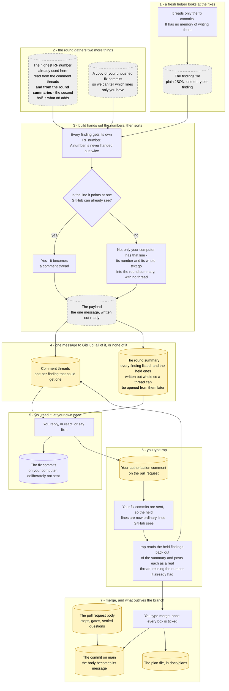

> 🤖 Written by AI --- read/modified by izkreny! 🤓

# Let a scoped re-review post new findings

Closes #8. The route is the fifth option recorded on that issue rather than any of the four in its body: the round hands `build` the unpushed diff, `build` assigns an `RF{n}` to every finding and writes the anchorless ones into the record Review instead of the `comments` array, and `rnp` posts them as real threads with those same ids the moment its push makes their lines visible. The highest-id read widens to review bodies so a reserved id can never be handed out twice while it waits.

## Why this shape

The four options in the issue body each give up a gate. Re-anchoring loses the finding's subject, an unanchored Conversation comment loses the thread the merge gate audits, running the re-review after the push loses the anchoring the held commits exist to preserve, and deferring loses the id. The fifth gives up none: no bad anchor is ever sent, so the atomic call still succeeds; the id is reserved and greppable; and the thread lands on the next pass with no special handling.

The four blocks #31 hit are all in `plugins/gh-solo/skills/pr-flow/scripts/post-review.py`, and this plan removes each: `record_body` composes from the findings list only, every list entry becomes an inline comment, a `re-review` file needs verdicts, and `build` derives ids from `--continue-from` plus index. Only the second and the fourth actually have to change - the flagged finding stays in the list, keeps its index, and takes its id from the same sequence; what changes is which findings reach `payload["comments"]`.

**The orchestrator decides which findings have no anchor, and it is the only party that can.** The reviewer has read the fix range and knows nothing about the pushed head, and `build` is a pure function over the files it is handed; the round holds both facts, since it is what is holding the fix commits. So the round writes `git diff @{u}..HEAD -U0` to a file and passes it as `build --unpushed-diff`, and `build` marks a finding whose `line` falls inside one of those hunks. This is why no per-finding field is needed: the findings file format is untouched and the `reviewer` skill's contract does not change.

**The test over-flags, in the safe direction.** A fix commit that edits a line the pull request already added leaves an anchor GitHub would resolve, at the pre-fix content, and marking it anyway costs a thread a few minutes later rather than the atomic `422` that takes every verdict down with it.

**The record Review is the waiting room, and `rnp` empties it.** A held finding is not deferred to some later pass: `plugins/gh-solo/skills/pr-flow/workflows/resolve.md` pushes the fix commits, which makes the held lines ordinary lines the pull request's diff contains, and the round then posts each held finding as an inline thread carrying the id it was already given. So every finding of every round ends as a thread the merge gate can audit, and the reserved id exists precisely so the thread that eventually opens is the same finding rather than a new one.

**The held findings travel as a fenced JSON block inside the record Review body, not as prose rows.** Reading them back is what `rnp` has to do, and a store that survives the owner taking two days is the whole reason the record Review holds them rather than the scratchpad - but parsing our own markdown prose back out would be fragile in a way JSON is not. The block sits inside a capped section without counting toward the cap, per *Never counted* in `plugins/gh-solo/skills/pr-flow/references/post-caps.md`, so nothing has to be traded for it.

`highest-id` reads `pulls/{pr}/comments` alone, which is why *Ids never restart* currently forbids issuing the id at all. `record_body` already prints one `- RF{n} ...` row per finding into a Review body that is posted and greppable on `pulls/{pr}/reviews`, so widening the read to that surface is what makes the reservation safe.

## How it will work

The stages this branch changes are 2, 3 and 6; the rest is the surrounding flow, drawn so the changed parts have somewhere to sit. Where this diagram and the prose above disagree, the prose is right - it is the one the reviewer reads.

## Steps

- Add `--unpushed-diff <file>` to `build` in `plugins/gh-solo/skills/pr-flow/scripts/post-review.py`, required when `pass` is `re-review` and refused when `pass` is `review` - a full pass runs on the pushed head, so a finding it cannot anchor is the reviewer failing to anchor, which the `reviewer` skill already says to drop.
- Parse the new-side hunk ranges out of that diff and mark a finding whose `path` and `line` fall inside one, refusing a diff whose shape does not parse rather than silently marking nothing.
- Change `build` so ids are assigned over every finding in index order, unchanged, while `payload["comments"]` is built from the unmarked findings only - the marked ones travel in the record Review alone.
- Change `record_body` so a marked finding's row says it has no thread yet, and the pass sentence counts threaded and reserved findings separately, which is this issue's second acceptance criterion.
- Have `record_body` also emit the marked findings whole - id, severity, axis, `path`, `line`, `side`, the finding text and the failure scenario - as a fenced JSON block, since a thread cannot be opened later from a row that carries only a `file:line`.
- Add a `release` mode to the script: it reads the reviews listing, parses those JSON blocks, and writes a comments-only payload whose bodies carry the ids the findings already hold, refusing an id that is already a thread on the pull request.
- Add the release to `plugins/gh-solo/skills/pr-flow/workflows/resolve.md`, after its push and before its report: run `release`, post the payload, then reconcile it with `verify`.
- Widen `verify` to read the reviews listing too, so it can confirm that a reserved `RF{n}` landed in a review body when `build` held it back and became a thread once `release` posted it - it iterates the payload's `comments` array alone today, so a held finding is invisible to it either way.
- Change `highest-id` to read review bodies as well as inline comments, taking the `pulls/{pr}/reviews` listing as a second required input, and refusing the same wrong `--slurp` shape it already refuses for comments.
- Extend `plugins/gh-solo/skills/pr-flow/scripts/test-post-review.sh` with cases for each of those: a `build` whose payload omits the marked finding from `comments` while its whole text appears in the record body's JSON block, a `build` refused for `--unpushed-diff` on a `review` pass and for its absence on a `re-review`, a `build` fed a fix-range diff that marks exactly the findings inside its hunks, a `release` that round-trips a held finding out of a reviews listing into a comments-only payload with its id intact, a `release` refused for an id that is already a thread, and a `highest-id` whose answer comes only from a review body.
- Rewrite step 5 of `plugins/gh-solo/skills/pr-flow/workflows/review.md` and step 5 of `plugins/gh-solo/skills/pr-flow/references/review-protocol.md` to state the new route, and delete the paragraphs naming this as a known limitation tracked by an issue.
- Add the extra `gh api --paginate "repos/{owner}/{repo}/pulls/<pr-number>/reviews"` read to step 2 of `plugins/gh-solo/skills/pr-flow/workflows/review.md`, beside the comments read it already makes, and pass both to `highest-id`.
- Add the `git diff @{u}..HEAD -U0` write to step 5 of `plugins/gh-solo/skills/pr-flow/workflows/review.md`, and pass the file to `build --unpushed-diff`.
- Move `plugins/gh-solo/.claude-plugin/plugin.json` to `4.1.0`: new behaviour for whoever installs the package, and nothing an existing round did stops working.

## Verification

- [ ] `python3 plugins/gh-solo/skills/pr-flow/scripts/docs-check.py plugins/gh-solo .agents/gh-solo.md AGENTS.md docs/plans --ignore '.claude/*' --ignore 'docs/plans*' --ignore '*GHI-50*'`
- [ ] `python3 scripts/version-check.py`
- [ ] `bash plugins/gh-solo/skills/pr-flow/scripts/test-post-review.sh`

Every new bench case is watched failing against the current `plugins/gh-solo/skills/pr-flow/scripts/post-review.py` before the fix lands, which is what makes it evidence: today's `build` puts the flagged finding in `comments`, which is the payload GitHub answered `422` to on #6 and on `izkreny/groupifico#210`, and today's `highest-id` answers `0` on a pull request whose only id is in a review body.

What none of these gates can see is whether the route works against GitHub. The bench proves no bad anchor is sent; only a real scoped re-review raising a new finding proves the id reserves, the record reads correctly and the thread lands on the next pass. That is this issue's first acceptance criterion and it is the owner's judgement, not a box.

## Open questions

- Should `--reviews` be required on `highest-id`, as planned, or optional? Required means a caller cannot under-read the id space by omitting it, which is the exact failure this issue is about; optional keeps every existing invocation of the script working.

## Settled

- **Who decides that a finding has no anchor yet?** The orchestrator, per the owner's decision on the plan's line 43. The reviewer cannot see the pushed head and `build` has no business fetching it, so the round writes `git diff @{u}..HEAD -U0` and hands it over as `build --unpushed-diff`. This removes the per-finding field the plan first proposed, and with it any change to the `reviewer` skill.
- **Does the first acceptance criterion close on this branch's own re-review?** No, it waits for a later pull request. A round spawns the reviewer and runs `plugins/gh-solo/skills/pr-flow/scripts/post-review.py` from the *installed* plugin, so this branch's own re-review exercises 4.0.0's script; the criterion closes on the first scoped re-review raising a new finding after `gh-solo_4.1.0` is tagged and installed.
- **Do the held findings ever become threads, or are they rediscovered?** They become threads, decided on the plan's line 44. `rnp` pushes the fix commits and then posts each held finding with the id it already holds, so the record Review is a waiting room rather than an archive and `plugins/gh-solo/skills/pr-flow/workflows/merge.md`'s thread audit sees every finding of every round.
