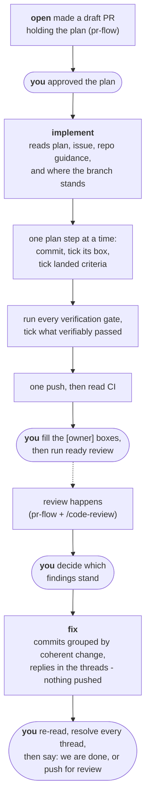

> 🤖 Written by AI --- read/modified by izkreny! 🤓

# implement

Turns an approved plan into commits, and review findings into fixes. This is the middle of a branch's life: `pr-flow`'s `open` creates the draft PR this skill requires, and its `ready`, `review` and `merge` take over the moment this skill's work is pushed.

Run `/gh-solo:implement <pr-number>` to implement, `/gh-solo:implement fix <pr-number>` once you have said which findings stand. This page is the why.

## The shape of it

The rounded steps are yours, same rule as everywhere in this flow: the skill will not do them for you or pretend it has.

## Why it works this way

**All state lives on the PR and the branch, none in the session.** The ticked boxes are the progress record, the commits are the evidence, and the skill starts every run by reconciling the two. That is what makes implementation resumable: a session that dies mid-branch loses nothing, and the next one - or a freshly spawned agent - picks up at the first unticked step whose work is not in the commits. Even the handoff itself lands as a PR comment, so the implementer's own account of what it did outlives the session that did it. It is also why boxes are ticked at the moment work lands, never in a batch at the end: a batch-ticked body cannot be resumed from, and cannot be audited.

**Commits group by coherent change, not by plan step.** The repository squash-merges, so branch commits never reach the trunk; their readers are your review diff and a mid-branch `git bisect`. Each commit builds and makes sense alone - and neither extreme serves anyone, a commit per keystroke or one monolith carrying the whole branch.

**The implementation travels in one push, after the gates go green locally.** Every push to a PR branch triggers CI, so pushing incrementally buys nothing but red runs against half-done work. One push means the first CI answer is about the finished record - which is exactly what `ready` reconciles next. Two exceptions: the settled plan is pushed **before** the first implementation commit, so the plan you agreed to is separately visible on the remote rather than buried under the code; and a session ending before the work does pushes as a backup, flagged as mid-work.

**The plan is never edited to hide divergence.** Where reality contradicts it, the disagreement lands as a PR comment and the plan stays as written - the plan records intent, and the gap between intent and outcome is information the later audits read. A divergence that changes scope stops the work and asks you, because what ships is your decision, not the implementer's. The one legitimate plan edit is the opposite case: a decision you settled in a plan-discussion thread is a change of intent, and it lands as a new commit on top of the plan - never a rewrite of the original plan commit, so the plan's evolution stays readable and the threads that argued it stay anchored - with the whole PR body updated to match - each answered question moved from its open-questions section into `## Settled` with your decision attached, where the squash merge will carry it onto the trunk's history - and the plan commits pushed, before the affected work begins.

**The implementer never marks its own work ready.** It produces the record - ticked steps, ticked gates, green CI - and stops, printing the `ready review` command for you to run. `ready`'s audit is worth something precisely because the auditor is not the author; an implementer that flips its own draft has erased that line. The same logic keeps `[owner]` boxes empty: a judgement check only you can make is named in the handoff, never ticked by an agent.

**Fixes are the same skill through a different door, and they never push.** Once you have said which findings stand - "fix all", "fix RF1 and RF3" - the `fix` entrance lands the fixes as commits grouped by coherent change, each naming the RF ids it closes, replies in each finding's thread, and posts the finding-to-commit map as a PR comment. Nothing leaves the machine: the threads stay anchored to the exact diff you are still reading, and the commits wait for your word - "we are done" to push, verify CI and merge, or "push for review" for another round - per the review protocol in `pr-flow`. It never resolves the threads either: resolving is your verdict alone, given after your reply, and the merge gate refuses on any thread missing one.

**The repository says how it is built and tested; the skill never does.** How code is written here comes from the repo's own agent instructions, the check commands from its `.agents/github.md`, and a repo silent on either gets that said in the handoff rather than improvised around. The floor underneath every repo: a behavior change carries a test, and a plan that names no gates stops the work with a question.

## Orchestration

This is the one skill in the flow whose work suits a cheaper model, because the expensive judgement is already spent by the time it runs: the plan is approved, or the findings are judged. So the skill enforces the split rather than offering it: **every `/gh-solo:implement` invocation spawns the `implementer` agent** (this plugin's own, pinned to Sonnet), and the session you typed the command in syncs the plan record first, spawns the agent, and relays its handoff word for word. Orchestration stays in your main session on its own model; implementation runs in the subagent, resumable because all its state lives on the PR. The one session allowed to run the workflows inline is the implementer itself, which is what stops the spawn from recursing.

`pr-flow`'s `auto` and `go` chains build on the same spawn: implementer, handoff relayed, then `ready` and `review` Pass 1 back to back, one stop at the `/code-review` command only you can type. `auto <issue-number>` starts at the issue and skips your plan stop; `go <pr-number>` starts after you have read the plan.

## Layout

| Path | Holds |
|---|---|
| `SKILL.md` | routing, and the contract both workflows share |
| `workflows/implement.md` | plan to commits: load, reconcile, implement, verify, push, hand off |
| `workflows/fix.md` | review findings to fix commits - replied in-thread, gates re-run, held unpushed for your word |

Anything specific to one repository - its check commands, its testing philosophy - belongs in that repository's own agent instructions and `.agents/github.md`, never in this skill.
