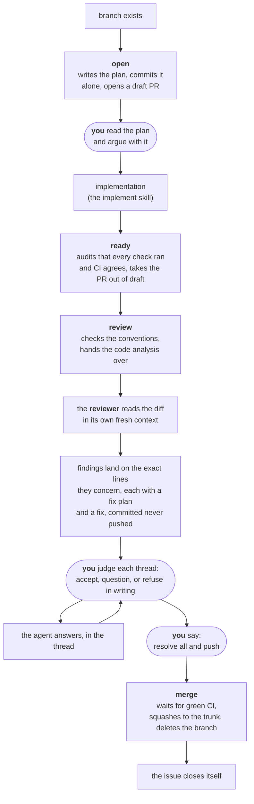

> 🤖 Written by AI --- read/modified by izkreny! 🤓

# pr-flow

Takes a branch from the moment it exists to the moment its code is on the trunk.

The tracker half of the story is `tracker`, whose README carries the full lifecycle graph. This skill owns the pull request: opening it, getting it reviewed, and landing it.

Run `/gh-solo:pr-flow help` for the commands. This page is the why.

## The shape of it

The rounded steps are yours. They are not delegated, and the skill will not do them for you or pretend it has.

## What is yours and what is not

| | Who does it |
|---|---|
| Writing the plan | the agent, from the issue and the code |
| **Deciding the plan is right** | **you** — this is a gate, and the work stops until you pass it |
| Writing the code | the agent, following the plan |
| Running tests and the build before review | the agent |
| Checking the PR's own housekeeping | the agent |
| **Starting the code review** | **you** — nothing else can start it |
| **Reading every line, and every comment on it** | **you** |
| Reading the diff and finding what is wrong with it | the `reviewer` agent, in its own context - never the session that wrote it |
| **Questioning a finding you disagree with** | **you**, by replying in its thread, or reacting 👀 |
| Answering that question, in the same thread | the agent |
| **Leaving a signal on every thread** | **you** - a reaction is enough; a thread resolved with no recorded authority stops the merge |
| **Authorising the resolve** | **you**, always — in words, which get recorded on the PR |
| Fixing what the review found | the agent - committed at once in coherent groups, pushed never |
| **Saying when the fixes push** | **you** - "resolve all and push", the round's only push |
| Merging, cleaning up, confirming the issue closed | the agent |

Nobody else's approval gates a merge and nobody else is accountable for what ships. That is what makes reading the code your job rather than a formality.

## Why it works this way

**The pull request opens at the beginning, not the end.** It is the workspace for the branch, and for its first hours it contains nothing but a plan. That is deliberate: a plan is far easier to disagree with as a diff, on a page, than as a wall of chat you have to scroll back through.

**The work stops after the plan, and does not offer to continue.** Approving a plan is not the same as authorising the first line of code, and the skill treats them as separate decisions because they are. You get a considered gap in which to say "no, not like that" while it is still free.

**The chain commands compress the loop without loosening it.** `auto` runs issue to prepared review as one chain; `go` does the same starting from a plan you have already read. Each exists only as a literal command - typing it is the approval the skipped stop would have collected, given in advance - and none skips a gate: every audit still runs, any refusal ends the chain, and each stops at the step nothing can take from you, judging the findings. They arm the watch when they get there, so you can react as you read.

**The judgement is yours; the reading of the diff is not.** The diff is read by the `reviewer` agent this plugin ships, spawned with a PR number and nothing else, so that the session which wrote the code is not the session that judges it. It never suggests a fix: it names the defect, its consequence, and a failure scenario you can check. Where your harness cannot spawn a subagent, read the diff yourself and post the findings, which the flow records identically. What is never substitutable is that the analysis comes from something other than the author.

**Every review is recorded, including a clean one.** A pull request with no comments on it is ambiguous: it might have been read and found fine, or never read at all. So the outcome is always written onto the PR, even when the outcome is "nothing found". Later, that is the difference between knowing and guessing — and it is what merging checks before it will land anything.

**Agent posts say which process made them.** Everything an agent posts lands under your own login, so every comment, review and thread reply opens with the AI disclaimer and, under it, a `via` line naming the skill and workflow that posted it; the PR body carries the disclaimer alone, being unmistakably itself. Without the pair, an implementer's record, a divergence note and a review finding on the same PR are indistinguishable - from each other, and from you.

**Answered questions outlive the discussion that answered them.** The PR body's open questions are where the plan discussion starts, and each one you settle moves to a `## Settled` section with your decision attached, question included. Because the squash merge writes the PR body into the trunk commit, those decisions end up in `git log` permanently - which no comment thread ever does.

**The plan lists steps as bullets; the PR lists the same steps as checkboxes.** Same list, two jobs. The plan records what you *intended*, fixed at the moment it was written. The PR records what has *happened*, and has to be free to change. When the two drift apart, that is worth seeing: it means the scope moved.

**Each place holds its own fact, and none repeats another.** The issue holds what "done" means. The plan holds how. The pull request holds where things stand. One link per hop, which is why "implement PR 60" is a complete instruction on its own.

**There is no plan template.** A plan is written by an agent that has just read the issue and the code, and the sections worth having are the ones that particular problem raises. Only two headings are fixed, because other things have to find those lists: the **steps**, and how you will know it worked (**verification**).

**Everything squashes.** One issue is one branch is one pull request is **one commit on the trunk**. The trunk becomes a readable list of finished work rather than a transcript of how the work went. The plan commit, the false starts and the review fixes all served their purpose inside the PR and do not need to outlive it.

**Review fixes get their own commits, grouped by coherent change and never amended into the original work.** Not for the trunk's sake — squashing removes them anyway — but for yours, while the PR is open. It keeps "what changed because of the review" separable from the original work, which is the difference you most want to be able to see.

**And they stay unpushed while you read.** A push moves the diff and drops the threads anchored to it behind "Show outdated" - the ground shifting under a review that is part-way through. So a fix is committed and answered in its thread on the spot, and nothing leaves the machine until you say "resolve all and push". The full sequence lives in one place, `references/review-protocol.md`.

## Stacking, and when not to

Stacking is for one situation: a branch that depends on another branch that **has not merged yet**. Without it the second PR's diff contains the first PR's commits and the review becomes unreadable.

Work that starts from the trunk and merges to the trunk is an ordinary branch with an ordinary pull request. Making that into a stack of one buys nothing, and the skill will say so rather than building it.

Stacks are also the one part of this that bites when handled carelessly, so their whole operational story is kept in one file, `workflows/stack.md`, rather than spread through the others.

## Layout

| Path | Holds |
|---|---|
| `SKILL.md` | routing, and the conventions that span workflows |
| `workflows/open.md` | plan, first commit, draft PR, stop |
| `workflows/auto.md` | the `auto` and `go` chains: the same lifecycle, waits removed, gates intact |
| `workflows/ready.md` | auditing that every stated check actually ran and CI agrees, then out of draft |
| `workflows/review.md` | conventions, handoff, and recording the outcome |
| `workflows/discuss.md` | answering your replies, inside the thread you asked in |
| `workflows/merge.md` | the reviewed-or-not gate, squash, cleanup |
| `workflows/stack.md` | everything about stacks |
| `workflows/help.md` | printed to you on `help` |
| `references/review-protocol.md` | the review round, stated once: RF ids, fixes committed in-thread but never pushed, your closing words, and the thread gates |
| `scripts/docs-check.py` | path and fence checks, run before any docs or plan push |

Anything specific to one repository — its check commands, a convention that differs — belongs in `.agents/github.md` in that repository, never in this skill. Check commands especially are never invented: they belong to the repo that runs them.
