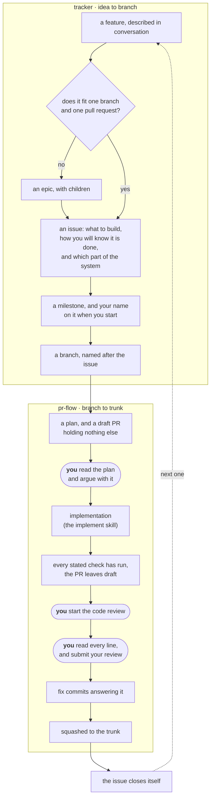

> 🤖 Written by AI --- read/modified by izkreny! 🤓

# tracker

The issue tracker for a repository you own and work on alone.

This skill owns what an issue *is*: how work gets broken down, what a good title looks like, which labels exist and what each one means. It stops where a branch begins; `pr-flow` carries it from there.

Run `/gh-solo:tracker help` for the commands. This page is the why.

## Install

This skill ships inside the `gh-solo` plugin and is not installed on its own:

```bash
claude plugin marketplace add izkreny/agentifico
claude plugin install gh-solo@agentifico
```

The plugin's own `README.md` has the local-checkout variant, the requirements, and what else installing it brings.

## The full lifecycle

Both skills are one loop. This one is the top half.



The dotted line back is the point worth noticing: nothing gets moved by hand. The pull request says which issue it closes, so merging closes it, and the loop starts again.

## What is load-bearing

**One person writes.** Not one person *involved* — a client setting scope and dates is fine, and so is a mentor who comments on issues and reviews pull requests. The line is whether someone's action is a write you have to coordinate with, or a read you can act on at your discretion. A second committer is genuinely out of scope, and the skill says so rather than quietly serving it badly.

**An issue is one branch and one pull request.** That is the entire sizing rule, and it is a shape rather than a number. Nothing is estimated and nothing is recorded — the question gets asked once while the issue is being written, and the answer is a decision, not data. Plain signs in the standards tell you to split instead, and the simplest is this: if the title needs "and" to be honest, it is two issues wearing one title.

**When in doubt, split.** Two issues that turn out to be one merge onto a single branch at no cost. One issue that turns out to be two is discovered halfway through, with a branch already open and criteria you cannot all tick.

**No issue is created from a file the tree might have rewritten.** When a breakdown's source is a file in the working tree - a roadmap, a spec - the tree is first checked against the remote and fast-forwarded or read around, because an issue written from a stale spec outlives the session and is indistinguishable from a correct one.

**Your name on an issue means "in flight".** A GitHub issue is only open or closed, with nothing in between, and assignment supplies the missing middle: yours while you are working on it or about to, cleared when you set it aside. That makes one query a live answer to "what am I in the middle of", across every repository at once. Nothing is assigned at creation, because every issue in your own repository is already implicitly yours and an assignment that says nothing costs the signal its meaning.

**Never label the default.** A label that lands on nearly everything is worse than no label. That is why there is no `feature` label, no size label, and no middle priority — with no triage step, a middle value records the absence of a decision rather than a decision. The same rule shapes readiness: most issues are created fully specified, so completeness carries no label, and `draft` marks the exception - an issue parked in the backlog before there was time or information to describe it, hidden from "next task" until its description is finished and the label comes off.

**Milestones close on scope, not on the calendar.** They are the sprint mechanism GitHub actually gives you. When the date arrives with work outstanding, move the date: closing the milestone would strand its open issues, which nothing reassigns for you.

## Why it works this way

**Titles carry no prefix.** No `[BE]`, no bracketed layer, no epic marker. Each of those facts already has exactly one home — the layer is a label, the kind is a label, the parent is a real relation — and a title that repeats one is noise in a list of eighty, plus a second place to update that will go stale.

**What changed and what got built are separate questions.** A branch is named for the kind of change it makes; a label says which part of the system the work lands in. Neither follows from the other, so a restructuring branch can perfectly well serve a new-feature issue. Never guess one from the other.

**Epics are real, not checkboxes.** An epic is an ordinary issue that other issues name as their parent, which GitHub understands: it draws a progress bar and it can be queried. A checkbox mentioning another issue's number is just text. Checkboxes are for steps inside one issue.

**Three levels is the limit.** If an epic's children need children of their own, the epic was a milestone.

**Acceptance criteria are checkboxes, and they live on the issue.** GitHub counts them and shows the count everywhere the issue appears, which is free progress tracking. They are not repeated in the plan or the pull request, because a fact in two places is a fact that will disagree with itself.

## Layout

| Path | Holds |
|---|---|
| `SKILL.md` | routing, the eligibility rule, the shared vocabulary |
| `references/standards.md` | the rulebook: hierarchy, titles, bodies, labels, milestones, formats |
| `references/github-access.md` | `gh` setup, and the failures that look like something else |
| `workflows/` | one file per command |

Anything specific to one repository — its own label set, a different branch convention — belongs in `.agents/gh-solo.md` in that repository, never in this skill. `pr-flow` reads the same file, so the two skills cannot disagree about a repository's conventions.

**The formats live here**, in `references/standards.md`: branch names, commit subjects, pull request titles, plan filenames. They belong to the tracker because every one of them encodes an issue number, and `pr-flow` points back here instead of restating them.
