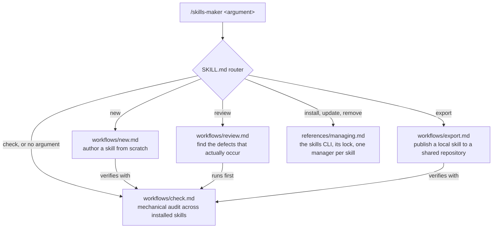

> 🤖 Written by AI --- read/modified by izkreny! 🤓

# skills-maker

A skill for writing, reviewing, maintaining and exporting agent skills. Explicit invocation only: it never fires on its own; you type `/skills-maker <argument>` yourself.

It targets the [Agent Skills](https://agentskills.io) format, the open standard originally developed by Anthropic and since adopted across the agent ecosystem (Claude Code, Cursor, Gemini CLI, GitHub Copilot, opencode, pi, Hermes and many more). The [specification](https://agentskills.io/specification) is the authority on the format, and the standard ships a [skills-ref](https://github.com/agentskills/agentskills/tree/main/skills-ref) reference validator; the traps this skill exists to catch live below the spec's radar, since a truncated description is still valid YAML.

## Why it exists

A defective skill does not error. It loads, it works when it happens to load, and it simply never fires when it should; the only thing you notice, if you ever notice, is an agent that quietly stopped using your best material.

The mechanical facts that make that silence possible, each learned from a real failure rather than from documentation:

- **The frontmatter `description:` is the entire trigger surface.** Nothing reads a skill's body until something has already decided to load it, so a trigger phrase written anywhere else never fires.
- **Unquoted YAML eats the description at ` #`.** In an unquoted scalar, a space followed by `#` starts a comment: everything after it is discarded with no parse error and no warning. The skill still loads and still works; the only symptom is triggers that never fire. Found live on a skill whose description contained "review PR #N" and was silently losing 160 characters of trigger text.

A skill that never fires looks identical to a skill that was never written. Every workflow here exists to tell the two apart before the difference costs you.

## How it works

`SKILL.md` is a router: it reads the argument, loads exactly one workflow file, and follows it inline, so the loaded context stays proportional to the task rather than to the skill.

| Argument | What it does |
|---|---|
| `new <name>` | Author a skill from scratch |
| `review <path>` | Review an existing skill for the defects that actually occur |
| `check`, or no argument | Mechanical audit across every installed skill |
| `export <path>` | Publish a local skill to a shared repository |

Requests about installing, updating or removing someone else's skill carry no verb of their own; the router sends them to `references/managing.md`.



The mechanical check is the shared foundation: authoring ends with it, review starts with it, and an export does not finish without it.

## Which model to run it with

Plan and author a new skill with the most capable model available to you, and run the skills-maker workflows themselves one tier below it. Authoring decides what will be true in the skill, which is open-ended judgement; review, check and export verify against rules already written down, which a lower tier does reliably and more cheaply.

## Install

```bash
npx skills add izkreny/agentifico -g -y -s skills-maker
```

That is the [skills CLI](https://skills.sh) in its no-install `npx` form. To have `skills` as a real command instead, [mise](https://mise.jdx.dev) installs it in one line, `mise use -g npm:skills`, and the `npx` prefix goes away. `references/managing.md` explains the flags, the lock file, and why one manager owns each skill.

## Similar tools, and why this exists anyway

This skill is agent-agnostic: it assumes a shell, a filesystem and Node, not one vendor's harness. The nearest neighbours are not: on Anthropic's official plugin marketplace, the `skill-creator` plugin measures skill behaviour with evals but has no review mode, and the `plugin-dev` plugin's `skill-reviewer` agent reviews text but enforces its own description style. Both, like every validator that parses frontmatter with a real YAML parser, silently accept the ` #` truncation, because the truncation is valid YAML; this skill checks the raw line instead, so the trap is visible to it alone. For behavioural doubts the tools are complementary, and `workflows/review.md` says to measure with whatever eval tooling the agent in use provides, naming Claude Code's built-in `claude plugin eval` as the example.

Worth a look rather than a dependency: [Hermes](https://github.com/nousresearch/hermes-agent) (Nous Research) genuinely self-learns, creating and patching its own skills from its sessions and gating agent-written ones behind approval and a content scanner; its creation triggers are the same judgement `workflows/new.md` encodes. [pi](https://pi.dev/docs/latest/skills) and [opencode](https://opencode.ai/docs/skills/) consume the same skill format but ship no creation or review tooling; both discover skills from other agents' directories, `~/.agents/skills/` included, which is exactly the shared layout `SKILL.md` recommends. None of them reviews skills, and none sees the truncation trap.
