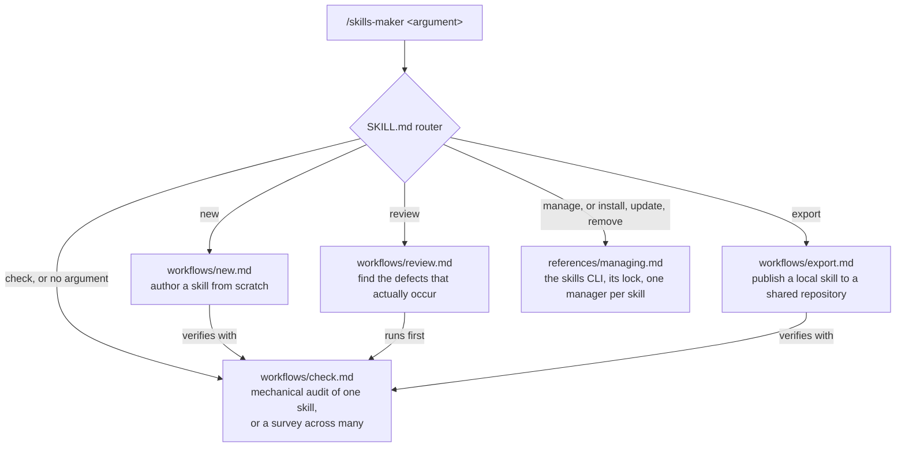

> 🤖 Written by AI --- read/modified by izkreny! 🤓

# skills-maker

A skill for writing, reviewing, maintaining and exporting agent skills. Explicit invocation only: it never fires on its own; you type `/skills-maker <argument>` yourself.

It targets the [Agent Skills](https://agentskills.io) format, the open standard originally developed by Anthropic and since adopted across the agent ecosystem. The [specification](https://agentskills.io/specification) is the authority on the format, and the standard ships a [skills-ref](https://github.com/agentskills/agentskills/tree/main/skills-ref) reference validator; the traps this skill exists to catch live below the spec's radar, since a truncated description is still valid YAML.

## Why it exists

A defective skill does not error. It loads, it works when it happens to load, and it simply never fires when it should; what you notice, if you ever notice, is an agent that quietly stopped using your best material.

The mechanical facts that make that silence possible, each learned from a real failure rather than from documentation:

- **The frontmatter `description:` is the entire trigger surface.** Nothing reads a skill's body until something has already decided to load it, so a trigger phrase written anywhere else never fires.
- **Unquoted YAML eats the description at a space followed by `#`.** In an unquoted scalar that pair starts a comment: everything after it is discarded with no parse error and no warning. The skill still loads and still works; the only symptom is triggers that never fire.

A skill that never fires looks identical to a skill that was never written. Every workflow here exists to tell them apart before the difference costs you.

## How it works

`SKILL.md` is a router: it reads the argument, loads exactly one workflow file, and follows it inline, so the loaded context stays proportional to the task rather than to the skill.

| Argument | What it does |
| --- | --- |
| `new <name>` | Author a skill from scratch |
| `review <path>` | Review an existing skill, or a whole package, for the defects that actually occur |
| `check`, or no argument | Mechanical audit of one skill, or a survey across a directory of them |
| `export <path>` | Publish a local skill to a shared repository |
| `manage` | Install, update, pin or remove a skill someone else wrote |

Requests about installing, updating or removing someone else's skill reach the same place phrased as a sentence; the router sends both to `references/managing.md`.



The mechanical check is the shared foundation: authoring ends with it, review starts with it, and an export does not finish without it.

## Which model to run it with

Plan and author a new skill with the most capable model available to you, and run the skills-maker workflows themselves one tier below it. Authoring decides what will be true in the skill, which is open-ended judgement; review, check and export verify against rules already written down, which a lower tier does reliably and more cheaply.

## Install

```bash
skills add izkreny/agentifico -g -y -s skills-maker
```

That is the [skills CLI](https://skills.sh), which [mise](https://mise.jdx.dev) installs in one line, `mise use -g npm:skills`. The mechanical checks then need their dependencies installed once, with `npm ci` run in the directory the skill landed in, and Vale on `PATH`, installed by whichever route [its installation page](https://docs.vale.sh/topics/installation) gives for the machine; `workflows/check.md` states both. `references/managing.md` explains the flags, the lock file, and why one manager owns each skill.

## What a YAML parser cannot see

This skill is agent-agnostic: it assumes a shell, a filesystem, Node 22 or later with one `npm ci` in the installed directory, and [Vale](https://vale.sh) 3.20 or later on `PATH` for the prose rules, not one vendor's harness.

**A validator that reads frontmatter through a YAML parser cannot see the space-and-`#` truncation.** The truncation is valid YAML, so the parser is handed a description that already ends early and has nothing to report. This skill checks the raw line instead, which is what lets it catch a family of traps a parsed read is defined not to reach; `workflows/check.md` lists them and `SKILL.md` explains each.

Behaviour is a different question, and this skill does not answer it. `workflows/review.md` says to measure that with whatever eval tooling the agent in use provides, naming Claude Code's built-in `claude plugin eval` as the example.
